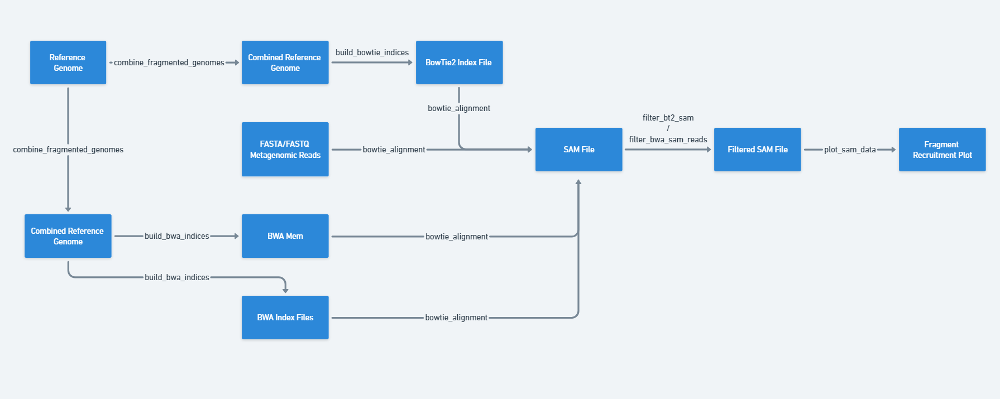

# Fragment Recruitment Plot Pipeline
## Author Information
* Name: Dien Mach
* UNIX (GCP) Username: ethanmach1998

## Project Overview
This README serves as a summarization of my metagenomics midterm project submission. For more information, please refer to the official writeup in the 'documents' folder.

The project consists of gathering metagenomic reads, aligning the reads to reference genomes using two alignment algorithms, and generating fragment recruitment plots.

Files related to this project are stored on Google Cloud in the 'AS41073481-dmach1' project within the 'metagenomics' instance. The metagenomic sample used is the HMP mock community reads obtained using Roche 454 sequencing technology.

## Data Gathering
* Downloaded FASTQ and FASTA reads for the Human Microbiome Project (HMP) mock community and transferred them to the Google Cloud Instance.
* Selected 10 bacterial reference genomes from the NCBI website to align reads against.

## Software and Dependencies
* Anaconda: Python distribution for data science.
* Bioconda: Channel for bioinformatics software.
* SnakeMake: Workflow management system.
* BowTie2: Tool for aligning sequencing reads.
* BWA: Software package for mapping sequences against a large reference genome.
* SAMtools: Suite of programs for interacting with high-throughput sequencing data.
* Python
  * MatPlotLib: Data Visualization Library.
  * Re: Regular Expressions Library.

## Alignment to Reference Genomes
* Employed two alignment algorithms: BowTie2 and BWA.
* Developed a Python script, 'contig_combiner.py', to standardize reference genome FASTA files
    * Contigs / scaffolds are artificially linked in-silico via a nucleotide sequence (XXXXX)

| Organism Name & Repository Number     | Taxon ID | Contig/Scaffold Count | GenBank Gene Count |
|---------------------------------------|----------|-----------------------|--------------------|
| Acinetobacter baumannii ATCC 17978    | 470      | 2/2                   | 3839               |
| Staphylococcus epidermidis ATCC 12228 | 1282     | 2/2                   | 2354               |
| Streptococcus pneumoniae ATCC BAA-334 | 170187   | 1/1                   | 2292               |
| Deinococcus radiodurans DSM 20539     | 243230   | 4/4                   | 3305               |
| Lactobacillus gasseri DSM 20243       | 324831   | 26                    | 1786               |
| Actinomyces odontolyticus ATCC 17982  | 411466   | 4/2                   | 2214               |
| Methanobrevibacter smithii ATCC 35061 | 420247   | 1/1                   | 1837               |
| Bacteroides vulgatus ATCC 8482        | 435590   | 1/1                   | 4183               |
| Enterococcus faecalis ATCC 47077      | 474186   | 75/NA                 | 2584               |
| Bacillus cereus ATCC 10987            | 2026187  | 239/222               | 5807               |

**Figure 1:** Table of all reference genomes downloaded from the NCBI website

## Fragment Recruitment Plots (FRPs)
* Crafted a script named 'sam_to_frp.py' to generate FRPs using alignment data from SAM files.
* The script parses the SAM file and employs matplotlib's plotly library for FRP visualization.

**Figure 2:** FRPs belonging to Taxon ID 243230 aligned using BowTie2 (above) and BWA-MEM (below)

## Workflow Automation and Pipeline Building with Snakemake
* Utilized Snakemake to streamline the alignment and FRP generation processes shown in the below Figure.
* Wrote a bash script, 'main.sh', containing all 10 snakemake commands automating the generation of the 20 FRPs

**Figure 3:** Snakemake Workflow Diagram Demonstrating the Directed Acyclic Graph pipeline.

## Analysis Highlights
* Most Represented Genome: Taxon ID 243230 (Deinococcus radiodurans DSM 20539) with a 35.24% overall alignment rate.
* Comparison: BowTie2 showcased faster runtimes and more descriptive statistics compared to BWA mem.

## Learnings and Challenges
* Gained proficiency in various tools and packages.
* Encountered challenges in data visualization with Matplotlib.
* Identified the need for further analysis scripts to compare alignment outputs.

## References
The article provides a list of 11 references, including links to official documentation, academic articles, and other resources.
